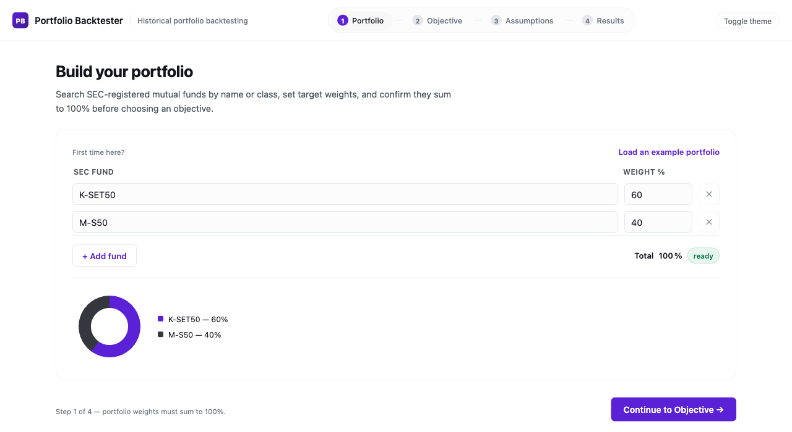

<div align="center">

<picture>
  <source media="(prefers-color-scheme: dark)" srcset="docs/assets/author-logo-dark.png">
  
</picture>

# Portfolio Backtester

**Historical portfolio backtesting on SEC Thailand Open Data mutual fund NAV series**

[](LICENSE)
[](pyproject.toml)
[](backend/app/main.py)
[](frontend/package.json)

Built by [**Supachok Julaupay**](https://github.com/bblank09) &middot; [github.com/bblank09](https://github.com/bblank09)

</div>

## Table of Contents

1. [Abstract](#1-abstract)
2. [Motivation & Research Question](#2-motivation--research-question)
3. [Screenshots](#3-screenshots)
4. [System Architecture](#4-system-architecture)
5. [Methodology](#5-methodology)
6. [Features](#6-features)
7. [Installation & Setup](#7-installation--setup)
8. [Usage](#8-usage)
9. [Project Structure](#9-project-structure)
10. [Testing & Validation](#10-testing--validation)
11. [Example Output](#11-example-output)
12. [Limitations & Known Issues](#12-limitations--known-issues)
13. [Roadmap](#13-roadmap)
14. [License](#14-license)
15. [Acknowledgments & Data Attribution](#15-acknowledgments--data-attribution)

---

## 1. Abstract

This project answers one question with a reproducible, formula-transparent backtest: *if an investor had held a given portfolio of Thai mutual funds over a historical period, with a given contribution/withdrawal schedule, rebalancing rule, and cost assumption, what would have happened?*

It is a full-stack application — a FastAPI backtesting engine over cached SEC Thailand Open Data NAV series, and a React/TypeScript dashboard for building portfolios and inspecting results (growth, drawdown, rolling risk, monthly return distribution, and an auditable formula reference).

## 2. Motivation & Research Question

Retail investors and quant-finance students in Thailand have no free, transparent tool to backtest portfolios built from Thai mutual funds specifically — global tools such as [Portfolio Visualizer](https://www.portfoliovisualizer.com/) and [testfol.io](https://testfol.io/) cover US/global assets but not SEC Thailand's fund universe.

**Research question:** given a set of SEC-registered mutual funds, target weights, a historical window, and a cashflow/rebalancing/cost policy, what is the resulting time-weighted return, volatility, drawdown profile, and benchmark-relative risk — computed transparently enough that every number traces back to a stated formula and a cached, inspectable NAV series?

The project deliberately excludes Monte Carlo simulation, portfolio optimization, efficient frontier construction, and live trading/broker execution — the scope is historical backtesting only, done rigorously.

## 3. Screenshots



_Step 1 of the guided workflow (Portfolio → Objective → Assumptions → Results): search-driven fund picker, live weight validation, and an allocation donut chart. A dark theme is also available via the top-bar toggle._

## 4. System Architecture

```text
┌─────────────────────┐        ┌──────────────────────────┐        ┌───────────────────────┐
│   SEC Open Data API  │  ---▶  │  Cache / normalize layer  │  ---▶  │  data/sec/normalized/  │
│  (fund NAV, profiles)│        │  (backend/app/sec/)       │        │  daily_nav.parquet     │
└─────────────────────┘        └──────────────────────────┘        └───────────┬───────────┘
                                                                                  │
                                                                                  ▼
┌─────────────────────┐        ┌──────────────────────────┐        ┌───────────────────────┐
│  React + TS frontend │  ◀--  │  FastAPI REST API         │  ◀---  │  Backtest engine        │
│  (frontend/src/)      │  ---▶ │  (backend/app/api/)       │  ---▶  │  (backend/app/engine/)  │
└─────────────────────┘        └──────────────────────────┘        └───────────────────────┘
```

**Tech stack**

| Layer | Technology |
| --- | --- |
| Frontend | React 18, TypeScript, Vite, hand-built SVG charting (no charting library dependency) |
| Backend | FastAPI, Pydantic v2, pandas, numpy, scipy |
| Data | SEC Thailand Open Data API, cached locally as Parquet |
| Testing | pytest (backend engine + API), tsc (frontend type-check) |

**Data flow:** SEC Open Data → `backend/app/sec/` fetch + normalize → local Parquet cache → `backend/app/engine/` computes the backtest against the cached panel → `backend/app/api/` serves the result → the frontend renders it across nine analysis tabs (Summary, Overview, Growth, Drawdown, Returns, Metrics, Cashflows, Rebalancing, Report).

## 5. Methodology

Full methodology and every formula used are documented and versioned in-repo, not just in this README:

- [`docs/methodology.md`](docs/methodology.md) — data source, NAV alignment rules, cashflow/rebalancing treatment, and how missing data is handled (never forward-filled into a fabricated return).
- [`docs/formula-reference.md`](docs/formula-reference.md) — every metric's exact formula (TWRR, CAGR, volatility, Sharpe, max drawdown, beta/alpha, tracking error, information ratio) with notation and implementation notes.
- [`docs/sec-api-contract.md`](docs/sec-api-contract.md) / [`docs/sec-data-inventory.md`](docs/sec-data-inventory.md) — the exact SEC Open Data endpoints and fields consumed.
- [`docs/objective-workflows.md`](docs/objective-workflows.md) — how the four objective presets (Past Performance, Monthly DCA, Monthly Withdrawal, Rebalancing Impact) map to required/optional inputs.

The in-app **Report** tab exposes this same audit trail per run: objective, inputs, formulas used, and stated limitations, exportable as `report.md`, `run_config.json`, and `metrics.json`.

## 6. Features

- **Guided 4-step workflow** — Portfolio → Objective → Assumptions → Results, with a top stepper bar; each step is validated before the next unlocks (e.g. weights must sum to 100% before continuing).
- **Search-driven fund picker** — click a fund field to browse the full SEC universe, or type to filter (by `proj_id`, fund name, or class); an allocation donut chart updates live as weights change.
- **Objective-driven assumptions** — four presets (Past Performance, Monthly DCA, Monthly Withdrawal, Rebalancing Impact) auto-fill required inputs while keeping everything editable, with a plain-language review summary before running.
- **Nine-tab result view** — Summary, Overview, Growth, Drawdown, Returns, Metrics, Cashflows, Rebalancing, Report.
- **Interactive charts** — hover crosshair with per-series tooltips, full date-labeled axes (not just start/end), min/max/latest stats, on every time-series chart in the app.
- **Monthly return heatmap, histogram, and rolling 12-month return/volatility/tracking-error.**
- **Cashflow simulation** — recurring contribution or withdrawal, configurable frequency and timing (beginning/end of period).
- **Rebalancing simulation** — none / monthly / quarterly / annual, with turnover and cost tracking.
- **Benchmark risk decomposition** — beta, alpha, tracking error, information ratio, correlation.
- **Light and dark themes** — toggle in the top bar, preference remembered across visits.
- **Reproducibility verification** — every run persists `request.json` + `result.json`; a saved run can be recomputed and diffed against the stored result (`scripts/sec_verify_run_reproducibility.py`).
- **Exportable research report** — Markdown report, run config, and metrics JSON, generated per run.

## 7. Installation & Setup

**Requirements:** Python 3.11+, Node.js (a recent LTS), and `npm`.

```bash
# Backend — the venv is created outside this directory because its path contains ":" and Python refuses to create a venv inside such a path
python3 -m venv /private/tmp/sec_open_data_portfolio_backtester_venv
source /private/tmp/sec_open_data_portfolio_backtester_venv/bin/activate
python3 -m pip install -U pip
python3 -m pip install -e ".[dev]"

# Frontend
npm --prefix frontend install
```

Copy `.env.example` to `.env` and set `SEC_API_KEY` only if you need to download or refresh SEC data — running a backtest against the committed local NAV cache does **not** call the SEC API and does not require a key.

## 8. Usage

**Run the dev servers** (from the repository root, so cache/run-artifact paths resolve correctly):

```bash
python3 -m uvicorn backend.app.main:app --reload
npm run frontend:dev
```

Open the frontend dev server URL and follow the 4-step workflow: build a portfolio (search and add SEC funds until weights sum to 100%), pick an objective preset, review/adjust assumptions, then run the backtest.

**Reproduce a saved run:**

```bash
python3 scripts/sec_verify_run_reproducibility.py <run_id>
```

This reruns the current engine against the same local NAV cache and compares selected summary metrics to the persisted result within a `1e-8` tolerance. It does not snapshot the historical cache, dependency versions, or engine version — a mismatch can mean the local cache or code changed since the run was saved, not necessarily a bug.

## 9. Project Structure

```text
backend/
  app/
    api/        # FastAPI routes (funds, backtests)
    domain/      # Pydantic schemas, enums
    engine/      # Backtest engine: returns, metrics, cashflows, rebalancing
    sec/         # SEC Open Data client, cache, normalizers
    reports/     # Markdown/report artifact generation
  tests/         # pytest suite (engine, API, SEC client, reproducibility)
frontend/
  src/
    api/         # Backend API client
    components/  # PortfolioStep, ObjectiveStep, AssumptionsStep, RunSummary (results), RunOverlay, Stepper
    objectives/  # Objective preset definitions
    pages/       # BacktestWorkspace (4-step wizard shell)
data/
  sec/           # Cached SEC NAV data (normalized cache is committed; raw cache is gitignored)
  runs/          # Persisted run artifacts (gitignored)
docs/            # Methodology, formula reference, SEC API contract, data inventory
scripts/         # Data download and reproducibility verification scripts
```

## 10. Testing & Validation

```bash
python3 -m pytest backend/tests        # backend engine + API tests
npx --prefix frontend tsc -b           # frontend type-check
```

The backend test suite covers the engine's return calculations, metrics, cashflow/rebalancing logic, the SEC client/normalizer, the report generator, and run reproducibility — not just API smoke tests.

## 11. Example Output

Running a Past Performance backtest on a two-fund equal-weight portfolio (2020-01-31 to 2024-12-31, THB 100,000 initial capital) produces, among other outputs, ending value, TWRR/CAGR, annualized volatility, Sharpe ratio, maximum drawdown, and benchmark excess return — each traceable to its formula in the Report tab. See [`docs/presentation-use-cases-and-workflow.md`](docs/presentation-use-cases-and-workflow.md) for a walked-through example.

## 12. Limitations & Known Issues

- **Not investment advice.** All outputs are historical simulations, not predictions or recommendations.
- **Survivorship bias**: verify whether the cached SEC fund universe includes funds that have since closed or merged before drawing conclusions from any comparison.
- **No live/real-time data** — the engine reads a locally cached NAV snapshot, refreshed manually via the download workflow.
- **Scope** — no Monte Carlo simulation, portfolio optimization, efficient frontier, or live broker execution by design.
- **Single-user, no persistence** — portfolios and results exist only in browser state for the current session; there is no account system or saved-portfolio database yet.

## 13. Roadmap

Planned next (see issues for detail): saved/shareable portfolios, side-by-side multi-portfolio comparison, portfolio templates, and CSV import from broker exports. Contributions and discussion welcome via GitHub Issues.

## 14. License

Released under the [MIT License](LICENSE).

## 15. Acknowledgments & Data Attribution

- **Author:** [Supachok Julaupay](https://github.com/bblank09) &mdash; [github.com/bblank09](https://github.com/bblank09).
- Fund NAV and profile data: [SEC Thailand Open Data](https://api.sec.or.th/) (Securities and Exchange Commission, Thailand).
- Reference tools consulted during design: [Portfolio Visualizer](https://www.portfoliovisualizer.com/analysis), [testfol.io](https://testfol.io/help), [Portfolio Performance](https://www.portfolio-performance.info/en/).
- Icons: [Lucide](https://lucide.dev/).
